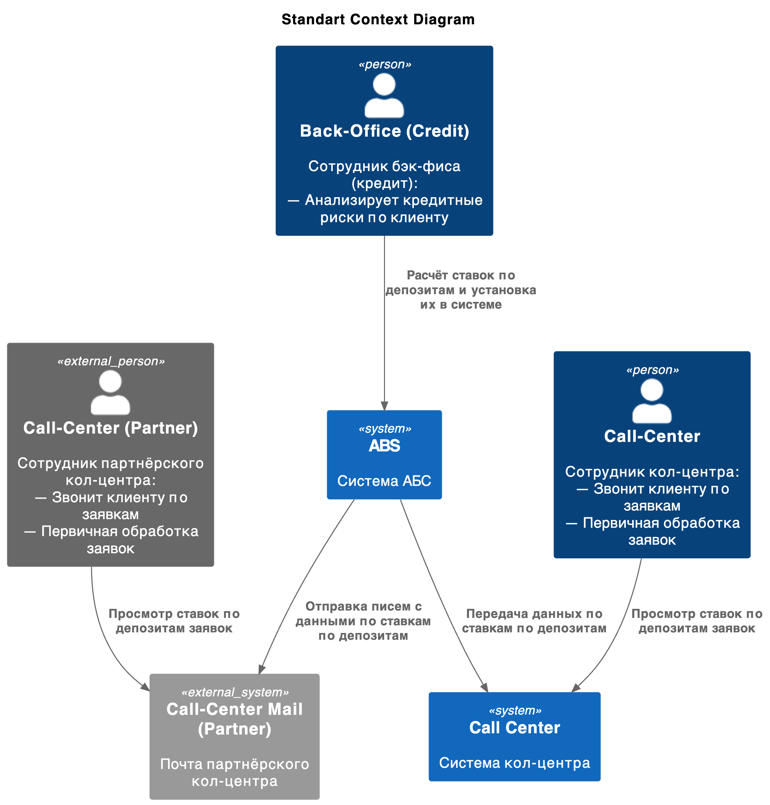
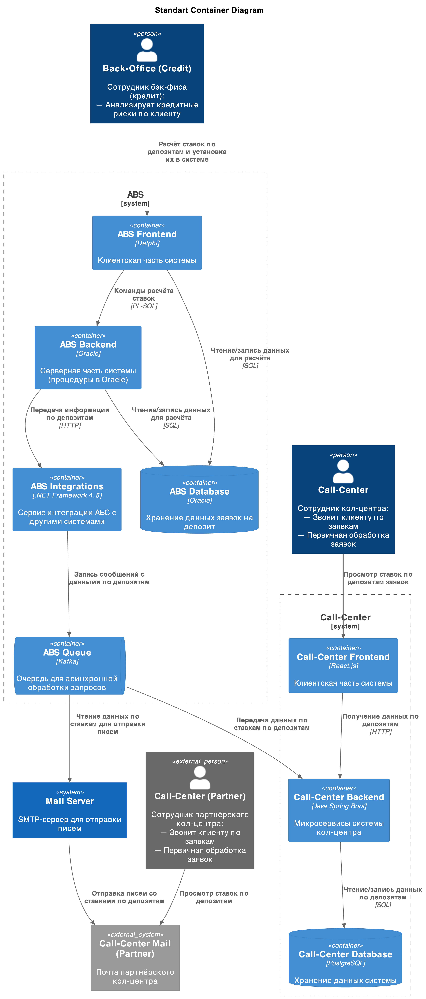
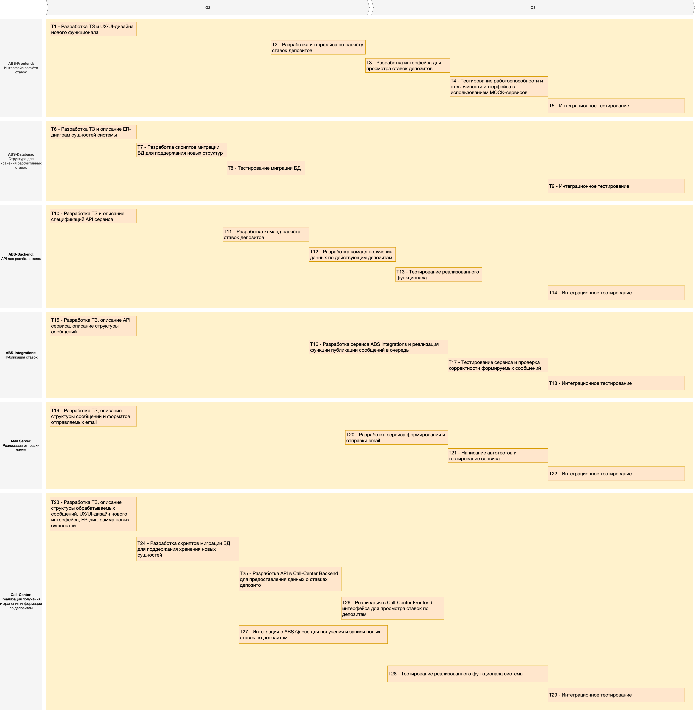

# Передача ставок в кол-центр

## ADR

- [ADR](./ADR.md)

## Context Diagram

## Container Diagram

## Список задач

1. ABS-Frontend: Интерфейс расчёта ставок
   1. Разработка ТЗ и UX/UI-дизайна нового функционала;
   2. Разработка интерфейса по расчёту ставок депозитов;
   3. Разработка интерфейса для просмотра ставок депозитов;
   4. Тестирование работоспособности и отзывчивости интерфейса с использованием MOCK-сервисов.
   5. Интеграционное тестирование.
2. ABS-Database: Структура для хранения рассчитанных ставок:
   1. Разработка ТЗ и описание ER-диаграм сущностей системы;
   2. Разработка скриптов миграции БД для поддержания новых структур;
   3. Тестирование миграции БД.
   4. Интеграционное тестирование.
3. ABS-Backend: API для расчёта ставок:
   1. Разработка ТЗ и описание спецификаций API сервиса;
   2. Разработка команд расчёта ставок депозитов;
   3. Разработка команд получения данных по действующим депозитам;
   4. Тестирование реализованного функционала;
   5. Интеграционное тестирование.
4. ABS-Integrations: Публикация ставок:
   1. Разработка ТЗ, описание API сервиса, описание структуры сообщений;
   2. Разработка сервиса ABS Integrations;
   3. Тестирование сервиса и проверка корректности формируемых сообщений;
   4. Интеграционное тестирование.
5. Mail Server: Реализация отправки писем:
   1. Разработка ТЗ, описание структуры сообщений и форматов отправляемых email;
   2. Разработка сервиса формирования и отправки email;
   3. Написание автотестов и тестирование сервиса;
   4. Интеграционное тестирование.
6. Call-Center: Реализация получения и хранения информации по депозитам:
   1. Разработка ТЗ, описание структуры обрабатываемых сообщений, UX/UI-дизайн нового интерфейса, ER-диаграмма новых сущностей;
   2. Разработка скриптов миграции БД для поддержания хранения новых сущностей;
   3. Разработка API в Call-Center Backend для предоставления данных о ставках депозитов;
   4. Реализация в Call-Center Frontend интерфейса для просмотра ставок по депозитам;
   5. Интеграция с ABS Queue для получения и записи новых ставок по депозитам;
   6. Тестирование реализованного функционала системы;
   7. Интеграционное тестирование.

